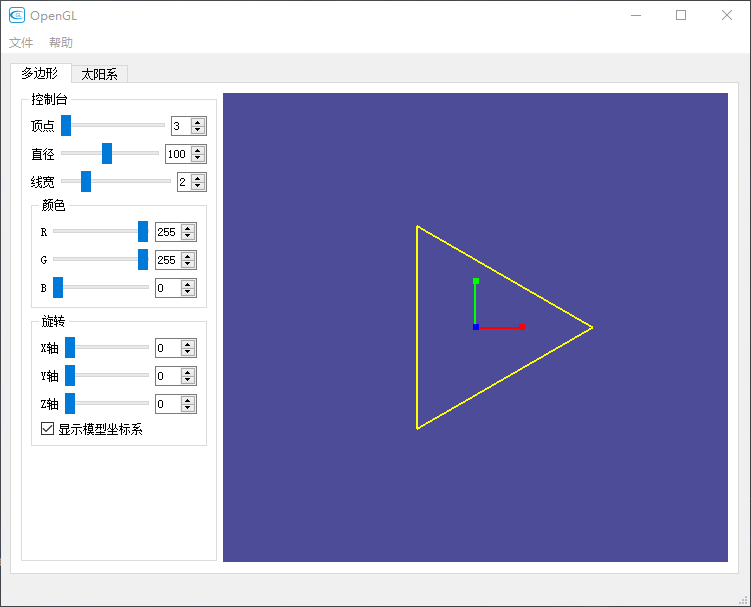

# 设计说明书

## 环境说明

本程序基于Python语言编写，界面基于PySide2开发，使用PySide2自带的QOpenGLWidget控件显示OpenGL窗口，底层使用PyOpenGL库调用OpenGL的API。

windows可执行程序位于`dist`目录下，双击`main.exe`即可运行。如无法运行，请联系我当面展示。

程序源代码位于`src`目录下，其中第一题的源代码位于`flines.py`文件中，第二题的源代码位于`solor.py`文件中，其他文件都是用于交互界面绘制。虽然python和C语言的语法大不一样，但是调用OpenGL的语法大体上是相似的。在前面提到的两个文件中，有三个核心方法(函数)：`initializeGL(self)`方法用于执行OpenGL窗口的一些初始化工作；`resizeGL(self, w, h)`方法用于定义窗口的大小缩放方式；`paintGL(self)`方法用于描述画面的绘制内容，程序会不断调用这个方法用于展示画面。

## 多边形绘制

### 程序展示

> 启动程序后会出现以下程序界面，界面左侧是控制台，右侧是OpenGL的显示窗口。



> 可以在左侧控制台控制多边形顶点数目、直径、线宽和颜色，也可以拖动滑块旋转图形。需要注意的是，图形旋转是按照XYZ的顺序依次旋转的。另外本程序还添加了是否显示模型坐标系的功能，使坐标旋转更加直观。


> 在右侧图形界面鼠标右键单击可以使用右键菜单，右键菜单功能在源代码中对应`rightMenu(self)`方法。另外在展示窗口滚动鼠标中键可以控制多边形的直径大小，快捷键F1~F4分别可以控制多边形绕X，Y正负方向旋转。


### 设计方法

+ 以下程序均可在`flines.py`文件中查看。

> 程序比较简单，主要讲一下多边形的绘制过程，其核心代码如下，首先要根据多边形顶点的数目和直径确定每个顶点的坐标，因为这些顶点分布在一个圆周上，先计算每段圆弧的角度，利用三角函数依次计算顶点的X、Y坐标，Z坐标统一设为零。每计算一个顶点坐标就将角度加一个弧度，将计算所得的顶点坐标都保存到`points_list`列表中。然后根据顶点坐标绘制顶点间的连线，本程序的思路是：从顶点列表中取出第一个顶点，和后面所有顶点进行连线，然后剔除第一个顶点，继续取出第一个顶点，和后面所有顶点进行连线，重复这个过程直到最后只剩一个点，这样就能不重复不遗漏的绘制所有直线了。

```python
# 圆弧等分点
theta = 2 * pi / self.num
angle = 0
z = 0
Point = namedtuple('Point', ['x', 'y', 'z'])
points_list = []
for i in range(self.num):
    x = self.dia / 2 * cos(angle)
    y = self.dia / 2 * sin(angle)
    angle += theta
    p = Point(x, y, z)
    points_list.append(p)

glColor3ub(self.r, self.g, self.b)  # 设置画笔色
glBegin(GL_LINES)
points_list2 = points_list[:]
for i1 in points_list:
    points_list2.pop(0)
    for i in points_list2:
        glVertex3f(i1.x, i1.y, i1.z)
        glVertex3f(i.x, i.y, i.z)
glEnd()
```
> 下面是坐标系的画法，用不同颜色区分不同坐标轴，都是简单的直线和点的绘制。
```python
if self.show_coor:  # 绘制模型坐标系
    glBegin(GL_LINES)
    # 以红色绘制x轴
    glColor4f(1.0, 0.0, 0.0, 1.0)  # 设置当前颜色为红色不透明
    glVertex3f(0.0, 0.0, 0.0)  # 设置x轴顶点（x轴负方向）
    glVertex3f(20, 0.0, 0.0)  # 设置x轴顶点（x轴正方向）
    # 以绿色绘制y轴
    glColor4f(0.0, 1.0, 0.0, 1.0)  # 设置当前颜色为绿色不透明
    glVertex3f(0.0, 0.0, 0.0)  # 设置y轴顶点（y轴负方向）
    glVertex3f(0.0, 20, 0.0)  # 设置y轴顶点（y轴正方向）
    # 以蓝色绘制z轴
    glColor4f(0.0, 0.0, 1.0, 1.0)  # 设置当前颜色为蓝色不透明
    glVertex3f(0.0, 0.0, 0.0)  # 设置z轴顶点（z轴负方向）
    glVertex3f(0.0, 0.0, 20)  # 设置z轴顶点（z轴正方向）
    glEnd()  # 结束绘制线段

    glPointSize(6)  # 设置点大小
    glBegin(GL_POINTS)  # 画点表示坐标轴正方向
    glColor4f(1.0, 0.0, 0.0, 1.0)
    glVertex3f(20, 0, 0)
    glColor4f(0.0, 1.0, 0.0, 1.0)
    glVertex3f(0, 20, 0)
    glColor4f(0.0, 0.0, 1.0, 1.0)
    glVertex3f(0, 0, 20)
    glEnd()
```
> 关于右键菜单和快捷键，因为采用Qt内置OpenGL控件的原因，无法直接调用glut的功能，但好在Qt控件也给我们提供了右键菜单和快捷键功能，只需以下的代码就可以实现该功能。

```python
# 右键菜单
self.setContextMenuPolicy(Qt.CustomContextMenu)
self.customContextMenuRequested.connect(self.rightMenu)
self.contextMenu = QMenu(self)
self.DD = self.contextMenu.addMenu('顶点个数')
self.D4 = self.DD.addAction('4')
self.D10 = self.DD.addAction('10')
self.D20 = self.DD.addAction('20')
self.ZJ = self.contextMenu.addMenu('直径')
self.ZJ50 = self.ZJ.addAction('50')
self.ZJ150 = self.ZJ.addAction('150')
self.ZJ200 = self.ZJ.addAction('200')
self.YS = self.contextMenu.addMenu('颜色')
self.YS1 = self.YS.addAction('绿色')
self.YS2 = self.YS.addAction('黑色')
self.YS3 = self.YS.addAction('白色')
self.D4.triggered.connect(lambda: self.changeNum(4))
self.D10.triggered.connect(lambda: self.changeNum(10))
self.D20.triggered.connect(lambda: self.changeNum(20))
self.ZJ50.triggered.connect(lambda: self.changeDia(50))
self.ZJ150.triggered.connect(lambda: self.changeDia(150))
self.ZJ200.triggered.connect(lambda: self.changeDia(200))
self.YS1.triggered.connect(lambda: self.changeRGB([0, 255, 0]))
self.YS2.triggered.connect(lambda: self.changeRGB([0, 0, 0]))
self.YS3.triggered.connect(lambda: self.changeRGB([255, 255, 255]))
# 快捷键
QShortcut(QKeySequence(Qt.Key_F1), self, lambda: self.RotF('F1'))
QShortcut(QKeySequence(Qt.Key_F2), self, lambda: self.RotF('F2'))
QShortcut(QKeySequence(Qt.Key_F3), self, lambda: self.RotF('F3'))
QShortcut(QKeySequence(Qt.Key_F4), self, lambda: self.RotF('F4'))
```


## 太阳系模型

### 程序展示

> 打开程序切换到太阳系标签页，程序默认展示如下图所示的动画模型。左侧控制台可以选择实体图或者线框图显示，也可以选择是透视投影还是平行投影，当选择透视投影时，还可以调节当前相机的视野锥角，默认为60°。


> 本程序最大的亮点在于在OpenGL窗口中按住鼠标左键拖拽可以旋转当前视角，滚动鼠标滚轮可以拉进或拉远视点，具体实现方法后面再说。左侧控制台显示一栏可以单独控制每个星球的显示与否，旋转菜单可以控制整个场景的旋转，X轴默认转到270°是为了让Z轴朝上。因为鼠标左键可以旋转视图，**不建议改动这里的旋转参数**，会使左键旋转视图的方向变得混乱。
>
> 底部还有几个小功能用于是否显示运行轨道和国旗，彩色轨道勾选后滚到颜色会不断变换，最底下的播放/暂停按钮用于控制动画的播放与暂停。


### 设计方法

+ 以下程序均可在`solor.py`文件中查看。

> 因为左侧控制台功能已经很全很方便了，这个案例就没有添加右键菜单了，转而添加了鼠标旋转和缩放视图的功能，这里的旋转和缩放视图并非是旋转和缩放模型坐标系，而是对相机的位置进行移动操作，主要利用了OpenGL的`gluLookAt()`函数对相机位置进行设定。为了方便描述相机的位置，本程序采用了球坐标系来描述相机的位置，通过接收鼠标左键移动的距离，按一定比例将移动距离映射到相机的角度上。缩放视图操作是接收鼠标中键滚动角度，按一定比例映射到相机和视点间的距离上。相关代码如下所示，其中`self.eye`表示相机的位置，`self.lookat`表示视点的位置，本程序固定在了原点处，`self.lookup`表示相机的正方向，`self.DIST`表示相机与视点间的距离，也就是球坐标系的半径，`self.PHI`和`self.THETA`分别表示球坐标系的两个角度。最终应用于`gluLookAt()`函数时要将球坐标系下的相机坐标转换到笛卡尔坐标中。

```python
def mouseMoveEvent(self, event):
    if event.buttons() == Qt.LeftButton:
        self.setCursor(Qt.OpenHandCursor)
        x = event.x()
        y = event.y()
        dx = self.MouseX - x
        dy = y - self.MouseY
        self.MouseX, self.MouseY = x, y

        self.PHI += np.pi * dy / self.height()
        self.PHI %= 2 * np.pi
        self.THETA += np.pi * dx / self.width()
        self.THETA %= 2 * np.pi

        self.eye[0] = self.DIST * np.cos(self.PHI) * np.sin(self.THETA) + self.lookat[0]
        self.eye[1] = self.DIST * np.sin(self.PHI) + self.lookat[1]
        self.eye[2] = self.DIST * np.cos(self.PHI) * np.cos(self.THETA) + self.lookat[2]

        if np.pi / 2 < self.PHI < 3 * np.pi / 2:  # 摄像机仰角到一定角度 头朝向得反过来
            self.lookup = np.array([0, -1, 0])
        else:
            self.lookup = np.array([0, 1, 0])
        event.accept()
        self.update()

def wheelEvent(self, event):
    angle = event.angleDelta().y() / 16
    self.DIST -= angle
    if self.DIST < 10:
        self.DIST = 10
    self.eye[0] = self.DIST * np.cos(self.PHI) * np.sin(self.THETA) + self.lookat[0]
    self.eye[1] = self.DIST * np.sin(self.PHI) + self.lookat[1]
    self.eye[2] = self.DIST * np.cos(self.PHI) * np.cos(self.THETA) + self.lookat[2]
    self.update()
```

> 球体的绘制。因为无法调用glut的缘故，不能直接使用现成的球体模型，因此本程序采用读取外部STL文件的方法绘制球体，直接采用现成的库进行读取STL文件获得点云，绘制球体的代码如下。

```python
def draw_sph(self, LineModel=False):
    """绘制球体"""
    if LineModel:  # 判断绘制方式
        glBegin(GL_LINES)
        for i in self.sph.points:
            glVertex3f(i[0], i[1], i[2])
            glVertex3f(i[3], i[4], i[5])
            glVertex3f(i[3], i[4], i[5])
            glVertex3f(i[6], i[7], i[8])
            glVertex3f(i[6], i[7], i[8])
            glVertex3f(i[0], i[1], i[2])
        glEnd()
    else:
        glBegin(GL_TRIANGLES)
        for i in self.sph.points:
            glVertex3f(i[0], i[1], i[2])
            glVertex3f(i[3], i[4], i[5])
            glVertex3f(i[6], i[7], i[8])
        glEnd()
```

> 主界面的绘制。在绘制星球前，要先调用一下`self.resizeGL`方法是为了及时改变投影方式以及投影参数，否则只有在画面大小改变的时候才能应用这些变化。然后设定`gluLookAt()`函数，接着对模型坐标系进行旋转变换使Z轴朝上便于鼠标操作视图。然后就是依次绘制各个星球，每次绘制前先判断该星球是否需要绘制，如果绘制开关打开，就先把当前矩阵压入栈中保存。先判断和绘制行星运行轨道，然后旋转行星公转角度，再沿X轴移动行星轨道半径，最后绘制星球，绘制完毕从栈中弹出矩阵继续绘制下一个。
>
> 关于国旗的绘制，因为不太理解题目中的绘制国旗具体是个什么展现方式，本程序就自由发挥，将一面国旗插在了月球上，国旗是采用纹理贴图的方式绘制的。

```python
def paintGL(self):
    glClear(GL_COLOR_BUFFER_BIT | GL_DEPTH_BUFFER_BIT)
    self.resizeGL(self.width(), self.height())  # 为了及时改变投影参数
    glMatrixMode(GL_MODELVIEW)
    glLoadIdentity()
    gluLookAt(self.eye[0], self.eye[1], self.eye[2],
              self.lookat[0], self.lookat[1], self.lookat[2],
              self.lookup[0], self.lookup[1], self.lookup[2])
    glRotate(self.XRot, 1, 0, 0)
    glRotate(self.YRot, 0, 1, 0)
    glRotate(self.ZRot, 0, 0, 1)
    # 太阳
    if self.ShowSun:
        glPushMatrix()
        glRotate(self.ASun, 0, 0, 1)
        self.sun(self.LineModel)
        glPopMatrix()
    # 地球和月亮
    glPushMatrix()
    if self.ShowEarth:
        self.draw_track(30)
    glRotate(self.AEarth, 0, 0, 1)
    glTranslatef(30, 0, 0)
    if self.ShowEarth:
        self.earth(self.LineModel)
    if self.ShowMoon:
        self.draw_track(4)
    glRotate(self.AMoon, 0, 0, 1)
    glTranslatef(4, 0, 0)
    if self.ShowMoon:
        self.moon(self.LineModel)
        if self.ShowFlag:
            # 绘制旗杆
            glBegin(GL_LINES)
            glColor4f(1, 1, 1, 1.0)
            glVertex3f(0, 0, 0)
            glVertex3f(0, 0, 50)
            glEnd()
            # 开启贴图模式
            glEnable(GL_TEXTURE_2D)
            glBindTexture(GL_TEXTURE_2D, 0)  # 选择纹理
            # 绘制国旗
            glBegin(GL_QUADS)
            glTexCoord2f(0.0, 0.0)  # 设置纹理坐标
            glVertex3f(0, 0, 30)
            glTexCoord2f(1, 0)
            glVertex3f(30, 0, 30)
            glTexCoord2f(1, 1)
            glVertex3f(30, 0, 50)
            glTexCoord2f(0, 1)
            glVertex3f(0, 0, 50)
            glEnd()
            glDisable(GL_TEXTURE_2D)  # 关闭纹理
    glPopMatrix()
    # 水星
    if self.ShowShui:
        glPushMatrix()
        self.draw_track(12)
        glRotate(self.AShui, 0, 0, 1)
        glTranslatef(12, 0, 0)
        self.shui(self.LineModel)
        glPopMatrix()
    # 金星
    if self.ShowJin:
        glPushMatrix()
        self.draw_track(20)
        glRotate(self.AJin, 0, 0, 1)
        glTranslatef(20, 0, 0)
        self.jin(self.LineModel)
        glPopMatrix()
    # 火星
    if self.ShowHuo:
        glPushMatrix()
        self.draw_track(40)
        glRotate(self.AHuo, 0, 0, 1)
        glTranslatef(40, 0, 0)
        self.huo(self.LineModel)
        glPopMatrix()
    # 木星
    if self.ShowMu:
        glPushMatrix()
        self.draw_track(55)
        glRotate(self.AMu, 0, 0, 1)
        glTranslatef(55, 0, 0)
        self.mu(self.LineModel)
        glPopMatrix()
    # 土星
    if self.ShowTu:
        glPushMatrix()
        self.draw_track(70)
        glRotate(self.ATu, 0, 0, 1)
        glTranslatef(70, 0, 0)
        self.tu(self.LineModel)
        glPopMatrix()
    # 天王星
    if self.ShowTian:
        glPushMatrix()
        self.draw_track(90)
        glRotate(self.ATian, 0, 0, 1)
        glTranslatef(90, 0, 0)
        self.tian(self.LineModel)
        glPopMatrix()
    # 海王星
    if self.ShowHai:
        glPushMatrix()
        self.draw_track(100)
        glRotate(self.AHai, 0, 0, 1)
        glTranslatef(100, 0, 0)
        self.hai(self.LineModel)
        glPopMatrix()
```

